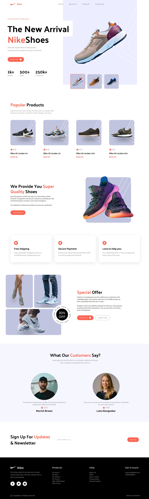

# Nike UI Clone Project

## Overview

This project is a clone of the Nike e-commerce user interface, developed using React and styled with Tailwind CSS. The aim of this project is to replicate the design and functionality of the Nike website, providing users with a seamless shopping experience.


 
## Features

- **Responsive Design:** The UI is fully responsive, ensuring a great experience on mobile and desktop devices.
- **Product Listings:** Dynamic product cards showcasing images, titles, prices, and ratings.
- **Product Details Page:** Detailed view of selected products, including images, descriptions, and size options.


## Tech Stack


  - React: JavaScript library for building user interfaces.
  - Tailwind CSS: Utility-first CSS framework for custom designs.


## Getting Started

To get a local copy of the project up and running, follow these steps:

```bash
git clone https://github.com/mohamedelmougy/nike-ui.git
npm i
npm run dev
```